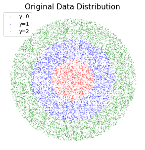

# Classifier Free Guidance on DDPM

This project implements the classifier-free guidance (CFG) mechanism on DDPM. The training process adopts a method called classifier-free guidance. Approximatly 10% of the time the model will be trained without conditioning on the label. The diffusion score can be interpreted as: $\hat{\epsilon}_{t} = (1-\gamma)\epsilon(x_t|0) + \gamma \epsilon(x_t|c).$

## Main Dependencies

- numpy
- matplotlib
- torch
- PIL

## Datasets

This project samples data from a circle which is divided into 3 parts/classes: the center circle, the middle ring and the outer ring, representing class 0, 1 and 2, respectively. The dataset is 2-dimensional. For better understanding, you may view each data point as a simplified image with only two dimensions. Each class of data points has a different distribution which is visulised as the three parts of the circle. The aim is to learn the original distribution like the following figure to allow us to sample data points from noise that align with the original distribution.

## Models

The project implements the classifier-free guidance from [Classifier-Free Diffusion Guidance](https://arxiv.org/pdf/2207.12598.pdf) on [DDPM](https://arxiv.org/pdf/2006.11239.pdf), which constructs a conditional diffusion model. After training, we can independently sample each part of the original circle given its label. By assembling these 3 parts, we can recover the original circle.

## Results

The following GIF shows the sampling process of the conditional diffusion model. Random noises are sampled first and the three sets of noises are conditioned on different labels. Then, the conditional diffusion model trained with CFG is used to denoise step by step and finally recover the original distributions.

